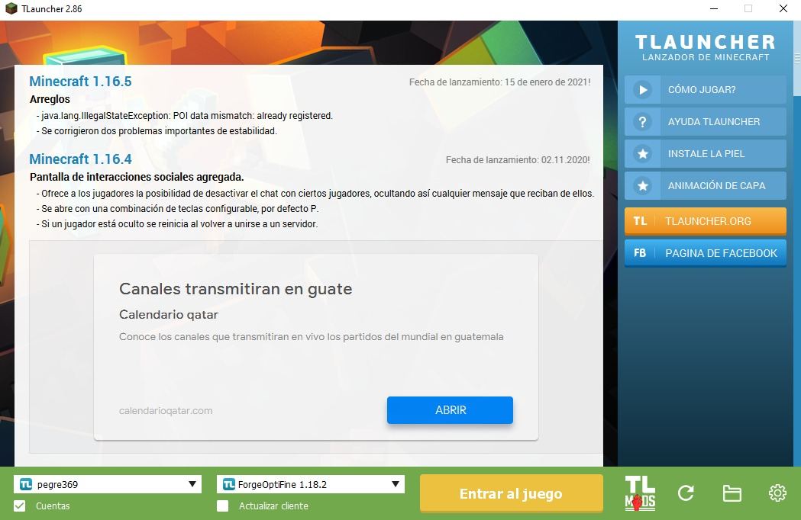
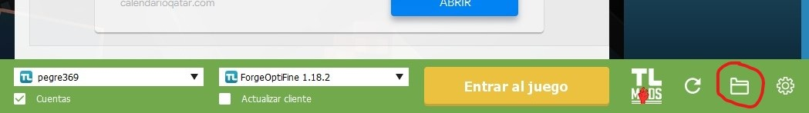
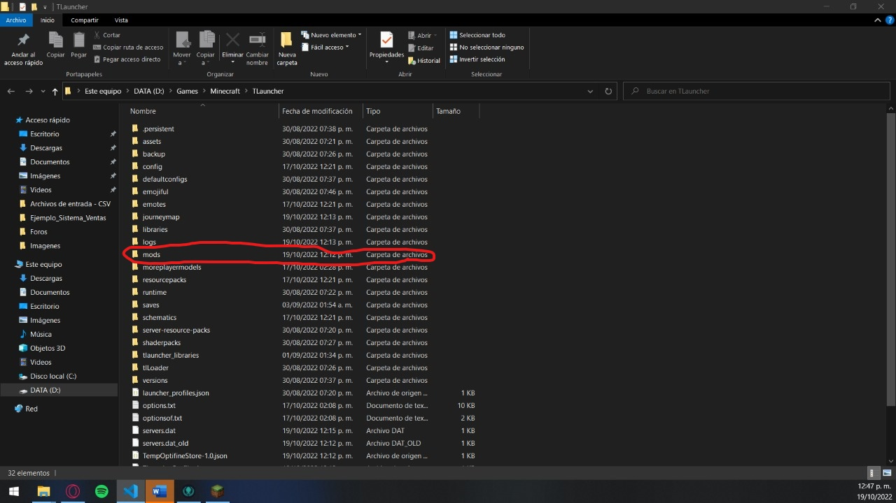
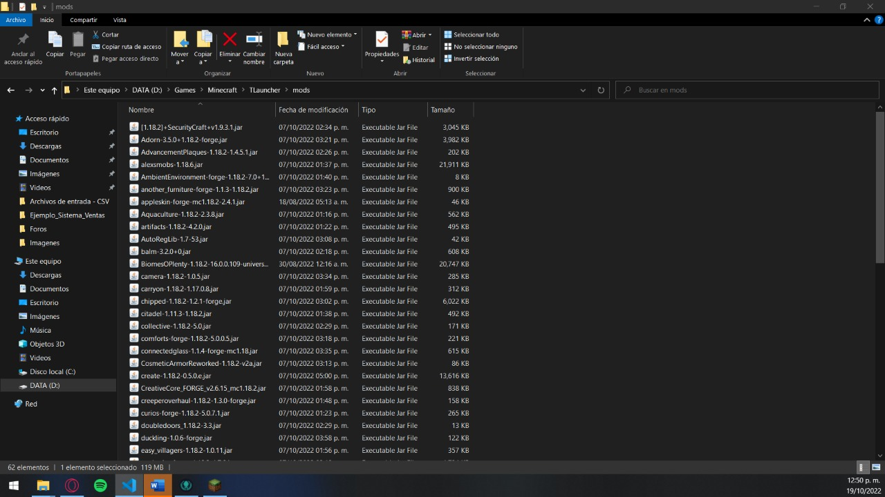

# Osakiworld-Mincrasft

## REGLAS:

* ## No robar en las casas de los compañeros
* ## Dejar espacio en las casas sercanas
* ## No explotar las casas de los demas
* ## Si quieres jugar en el server solo pide que lo enciendan por el grupo de whatsapp 🤗❤️

 

### Requerimientos:

* Tener instalado JDK-Java -> [Link de descarga](https://www.oracle.com/java/technologies/downloads/#jdk19-windows)
* Tener actualizados/descargados los siguientes Mods -> [Link de descarga](https://www.mediafire.com/file/uzjmv85vqysm9je/MODS2.rar/file)
* Tener una cuenta en TLauncher -> [Link para registrarse](https://tlauncher.org/en)
* Descargar el TLauncher para Linux/Windows/MacOS -> [Link de descarga](https://tlauncher.org/en)

 

### Instalacion del JDK-Java

* Para la instalacion en ***WINDOWS*** pueden consultar el siguiente video
  
  

  [INSTALAR JAVA EN WINDOWS](https://www.youtube.com/watch?v=kPWezAZGPks)

  

* Para la instalacion en ***LINUX-UBUNTU*** pueden consultar el siguiente video

  

  [INSTALAR JAVA EN LINUX-UBUNTU](https://www.youtube.com/watch?v=AE5cnH_Kmb8)

  

* Para la instalacion en ***MAC-OS*** pueden consultar el siguiente video

  

  [INSTALAR JAVA EN MacOS](https://www.youtube.com/watch?v=NXm29nZAGSY)

  

 

### Configuracion del TLauncher:

* Primero tenemos que instalar el TLauncher en nuestra maquina, despues de instalarlo nos aparecera la siguiente pantalla:

 
* Para poder acceder a nuestro server, tienen que ingresar con su cuenta creada en la pagina de TLauncher y tienen que seleccionar el cliente ***FORGEOPTIFINE 1.18.2*** como se muestra en la imagen anterior.

 

### Ingresar los Mods Descargados:

* Para poder acceder a la carpeta donde instalamos el TLauncher le damos clic a la carpeta que nos aparece en el lado inferior derecho.

 
* Eso nos direccionara a la ubicacion en donde tenemos instalado el TLauncher, ahora tenemos que buscar una carpeta llamada ***mods***
  

* Luego de darle clic a esta carpeta tenemos que descomprimir el archivo .rar que descargamos, el cual tiene todo los mods (En total son 61 archivos Jar). 

* Una vez terminamos de ingresar los mods procedemos a ingresar al juego.

### Datos para el Server

* Dentro del juego se van a la opcion de **MULTIJUGADOR**
* Luego buscan la opcion **Agregar Servidor** 
* En **Nnombre** ponen cualquier nombre
* En **Direcion IP** ingresan lo siguiente -> **OsakiWorld.aternos.me:31363**
* Luego aceptar y listo son parte de la comunidad.